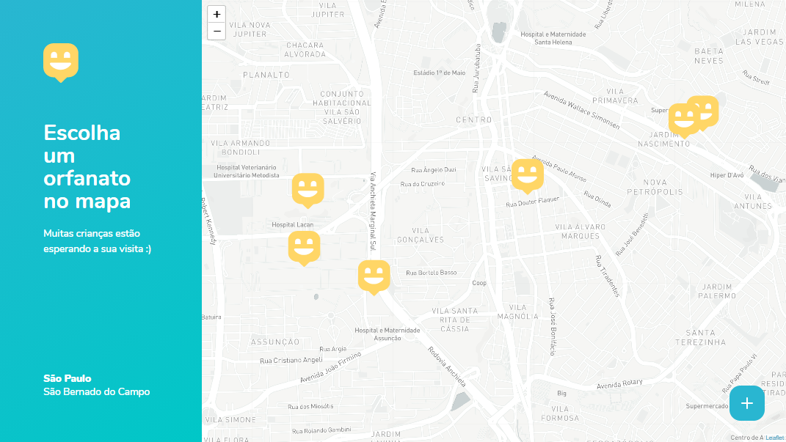
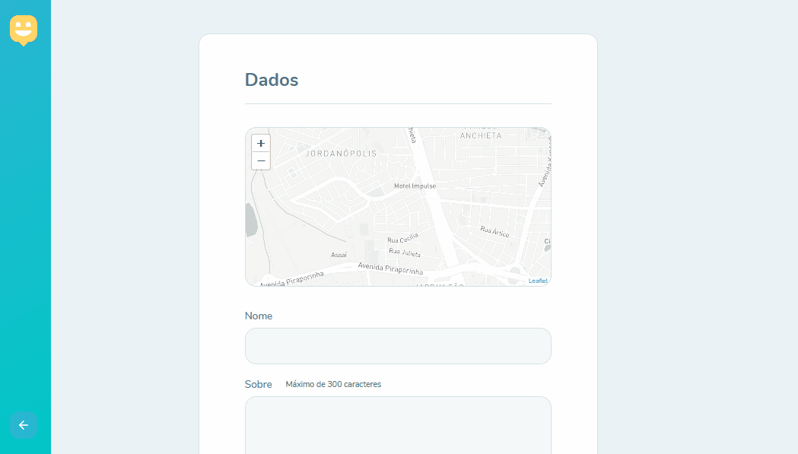
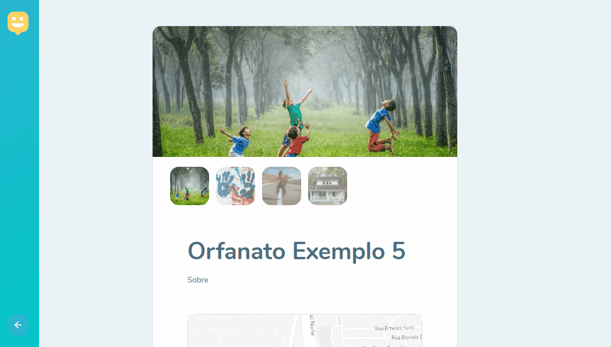

<p align="center">
  

  
  
  <a href="https://github.com/grochavieira/Happy/commits/master">
    
  </a>
    
   

  <a href="https://github.com/grochavieira">
    
  </a>
  
 
</p>
<h1 align="center">
    
</h1>

<h4 align="center"> 
	🚧  Aplicação finalizada! 🚧
</h4>

## 🏁 Tópicos

<p>
 👉<a href="#-sobre-o-projeto" style="text-decoration: none; "> Sobre</a> <br/>
👉<a href="#-funcionalidades" style="text-decoration: none; "> Funcionalidades</a> <br/>
👉<a href="#-layout" style="text-decoration: none"> Layout</a> <br/>
👉<a href="#-como-executar-o-projeto" style="text-decoration: none"> Como executar</a> <br/>
👉<a href="#-tecnologias" style="text-decoration: none"> Tecnologias</a> <br/>
👉<a href="#-autor" style="text-decoration: none"> Autor</a> <br/>
👉<a href="#user-content--licença" style="text-decoration: none"> Licença</a>

</p>

## 💻 Sobre o projeto

Uma aplicação para cadastrar orfanatos de São Bernardo do Campo (SP), para que usuários possam encontrar informações sobre eles.

---

<a name="-funcionalidades"></a>

## ⚙️ Funcionalidades

- [x] Back-end;
  - [x] Rotas;
    - [x] Cadastro de orfanatos;
    - [x] Listagem de orfanatos;
    - [x] Detalhes de um orfanato;
    - [x] Inserção de imagens no cadastro de orfanatos.
- [x] Front-end;
  - [x] Pagina Principal;
  - [x] Pagina de Mapas;
  - [x] Pagina para cadastro de orfanatos;
  - [x] Pagina para detalhes de orfanatos.
- [x] Mobile;
  - [x] Tela com a localização dos orfanatos;
  - [x] Tela para selecionar a posição do orfanato;
  - [x] Tela de cadastro de orfanatos;
  - [x] Tela de detalhes de orfanatos.

### A milha extra...

- [x] styled-components na inteface web;
- [x] styled-components na interface mobile;
- [x] troca de temas na web, e o tema é salvo no local storage;
- [x] troca de temas no mobile, de acordo com as preferências do sistema;
- [x] botão que redireciona para o whatsapp web/app (campo adicionado no back-end);
- [x] tela Home para o app mobile;
- [x] shimmer effect na tela de detalhes do mobile.

---

## 🎨 Layout

### front-end web

<div align="center">
    
    
</div>

<div align="center">
    
    
</div>

<div align="center">
    
    
</div>

<div align="center">
    
    
</div>

### mobile

<div align="center">
    
    
</div>

<div align="center">
    
    
</div>

<div align="center">
    
    
</div>

<div align="center">
    
    
</div>

<div align="center">
    
    
</div>

<div align="center">
    
    
</div>

<div align="center">
    
    
</div>

---

## 🚀 Como executar o projeto

Este projeto é divido em três partes:

1. Backend (pasta backend)
2. Frontend (pasta web)
3. Mobile (pasta mobile)

💡O Frontend e o Mobile precisam que o Backend esteja sendo executado para funcionar.

### Pré-requisitos

Antes de começar, você vai precisar ter instalado em sua máquina as seguintes ferramentas:
[Git](https://git-scm.com), [Node.js](https://nodejs.org/en/), [Yarn](https://classic.yarnpkg.com/en/docs/install).
Para a aplicação mobile, será necessário instalar o [Expo](https://expo.io/) para rodar o app no seu smartphone.
Além disto é bom ter um editor para trabalhar com o código como [VSCode](https://code.visualstudio.com/)

#### 🎲 Rodando o Backend (servidor)

```bash

# Clone este repositório
$ git clone https://github.com/grochavieira/Happy.git

# Acesse a pasta do projeto no terminal/cmd
$ cd Happy

# Vá para a pasta backend
$ cd backend

# Instale as dependências com npm
$ npm install

# Crie o banco de dados do sistema, caso não tenha
$ npm typeorm migration:run

# Execute a aplicação
$ npm run dev

# O servidor inciará na porta:3333 - acesse http://localhost:3333

```

#### 🧭 Rodando a aplicação web (Frontend)

```bash

# Clone este repositório
$ git clone https://github.com/grochavieira/Happy.git

# Acesse a pasta do projeto no seu terminal/cmd
$ cd Happy

# Vá para a pasta da aplicação Front End
$ cd web

# Instale as dependências
$ yarn install

# Execute a aplicação em modo de desenvolvimento
$ yarn start

# A aplicação será aberta na porta:3000 - acesse http://localhost:3000

```

#### 📱 Rodando a aplicação mobile (App)

```bash

# Clone este repositório
$ git clone https://github.com/grochavieira/Happy.git

# Acesse a pasta do projeto no seu terminal/cmd
$ cd Happy

# Vá para a pasta da aplicação Mobile
$ cd mobile

# Instale as dependências
$ yarn install

# Execute a aplicação em modo de desenvolvimento
$ yarn start

```

---

## 🛠 Tecnologias

As seguintes ferramentas foram usadas na construção do projeto:

#### **Website** ([React](https://reactjs.org/) + [TypeScript](https://www.typescriptlang.org/))

- **[React Router Dom](https://github.com/ReactTraining/react-router/tree/master/packages/react-router-dom)**
- **[React Icons](https://react-icons.github.io/react-icons/)**
- **[Leaflet](https://leafletjs.com/)**
- **[React-Leaflet](https://react-leaflet.js.org/)**
- **[Mapbox](https://www.mapbox.com/)**
- **[Axios](https://github.com/axios/axios)**
- **[Styled Components](https://styled-components.com/)**

> Veja o arquivo [package.json](https://github.com/grochavieira/Happy/blob/master/web/package.json)

#### **Server** ([NodeJS](https://nodejs.org/en/) + [TypeScript](https://www.typescriptlang.org/))

- **[Express](https://expressjs.com/)**
- **[CORS](https://expressjs.com/en/resources/middleware/cors.html)**
- **[TypeORM](https://typeorm.io/#/)**
- **[SQLite](https://github.com/mapbox/node-sqlite3)**
- **[ts-node](https://github.com/TypeStrong/ts-node)**
- **[Multer](https://github.com/expressjs/multer)**
- **[Yup](https://github.com/jquense/yup)**

> Veja o arquivo [package.json](https://github.com/grochavieira/Happy/blob/master/backend/package.json)

#### **Mobile** ([React Native](https://reactnative.dev/) + [TypeScript](https://www.typescriptlang.org/))

- **[Expo](https://expo.io/)**
- **[React Native Maps](https://github.com/react-native-maps/react-native-maps)**
- **[Styled Components](https://styled-components.com/)**
- **[React Navigation](https://reactnavigation.org/)**
- **[Expo Google Fonts](https://github.com/expo/google-fonts)**

> Veja o arquivo [package.json](https://github.com/grochavieira/Happy/blob/master/mobile/package.json)

#### **Utilitários**

- Editor: **[Visual Studio Code](https://code.visualstudio.com/)**
- Teste Mobile: **[Expo APP](https://expo.io/)**
- Teste do Banco de Dados: **[Beekeper-Studio](https://www.beekeeperstudio.io/)**
- Teste de API: **[Insomnia](https://insomnia.rest/)**
- Ícones: **[Feather Icons](https://feathericons.com/)**
- Fontes: **[Nunito](https://fonts.google.com/specimen/Nunito)**

---

<a name="-autor"></a>

## 🦸‍♂️ **Autor**

<p>
<kbd>
 
 </kbd>
 <br />
 <sub><strong>🌟 Guilherme Rocha Vieira 🌟</strong></sub>
</p>

[](https://www.linkedin.com/in/grochavieira/)
[](mailto:guirocha.hopeisaba@gmail.com)

---

## 📝 Licença

Este projeto esta sobe a licença [MIT](./LICENSE).

Feito com :satisfied: por Guilherme Rocha Vieira 👋🏽 [Entre em contato!](https://www.linkedin.com/in/grochavieira/)

---
