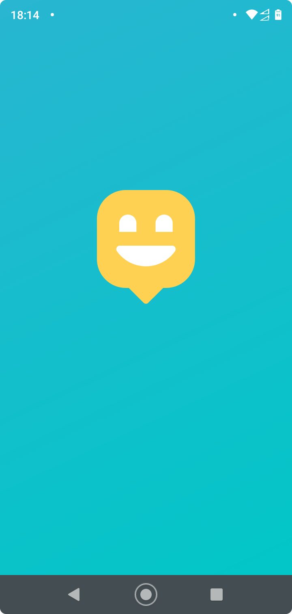
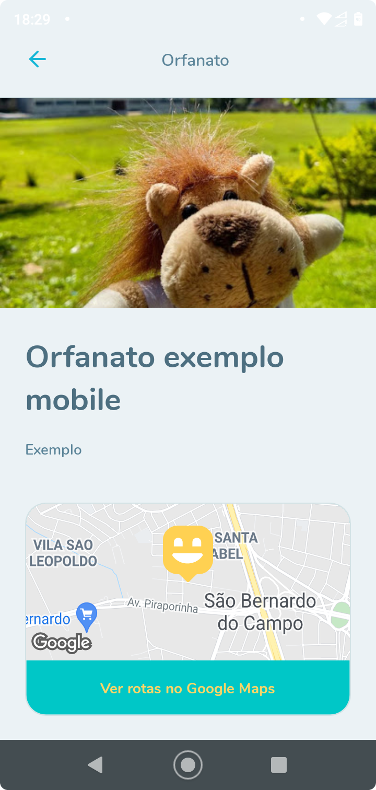
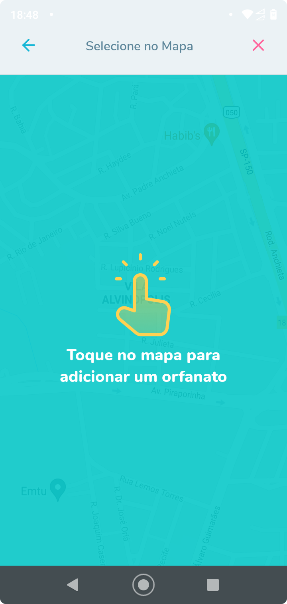
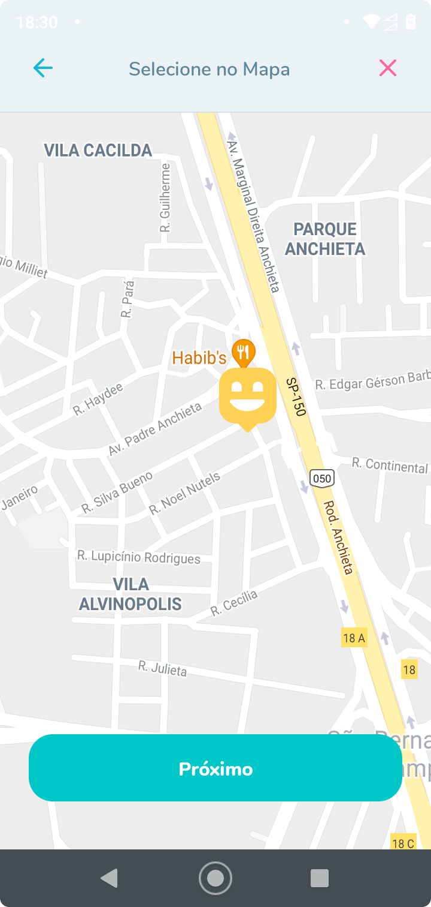
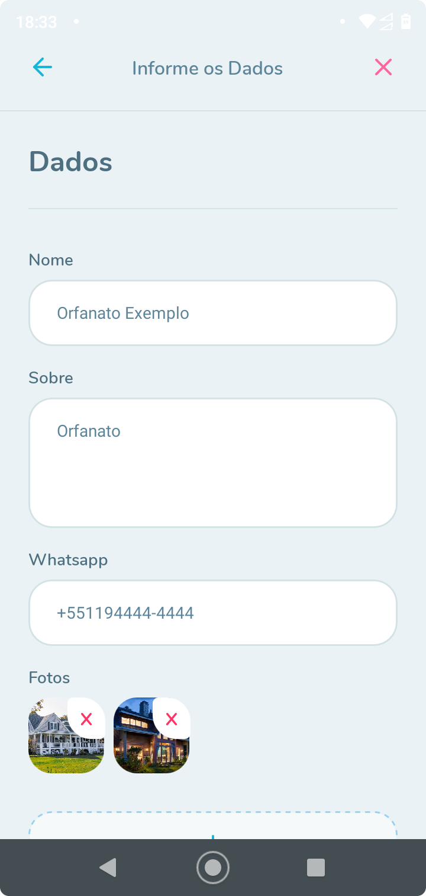
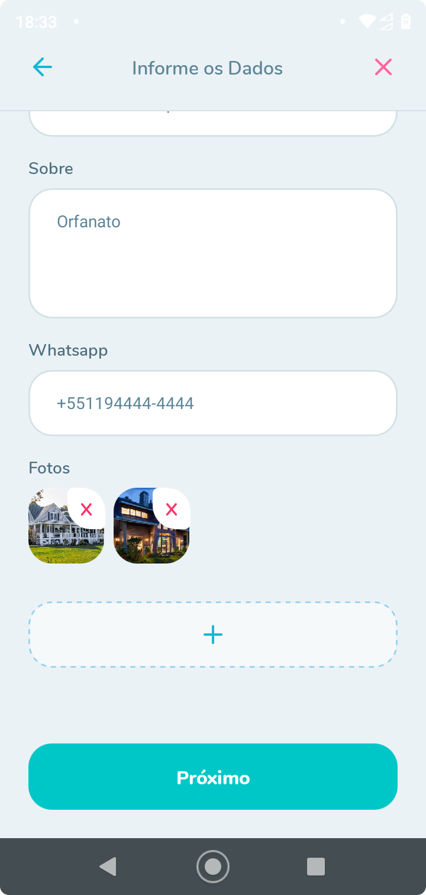

<p align="center">
  

  
  
  <a href="https://github.com/grochavieira/happy-mobile/commits/master">
    
  </a>
    
   
 
</p>
<h1 align="center">
    
</h1>

<h4 align="center"> 
	🚧  Aplicação em desenvolvimento - versão 2.0! 🚧
</h4>

## 🏁 Tópicos

<p>
 👉<a href="#-sobre-o-projeto" style="text-decoration: none; "> Sobre</a> <br/>
👉<a href="#-funcionalidades" style="text-decoration: none; "> Funcionalidades</a> <br/>
👉<a href="#-layout" style="text-decoration: none"> Layout</a> <br/>
👉<a href="#-como-executar-o-projeto" style="text-decoration: none"> Como executar</a> <br/>
👉<a href="#-tecnologias" style="text-decoration: none"> Tecnologias</a> <br/>
👉<a href="#-autor" style="text-decoration: none"> Autor</a> <br/>
👉<a href="#user-content--licença" style="text-decoration: none"> Licença</a>

</p>

## 💻 Sobre o projeto

Uma aplicativo para cadastrar orfanatos de São Bernardo do Campo (SP), para que usuários possam encontrar informações sobre eles.

---

<a name="-funcionalidades"></a>

## ⚙️ Funcionalidades

- [x] Tela Splash;
- [x] Telas de Onboarding;
- [x] Tela Home com animação;
- [x] Tela para ver os orfanatos cadastrados;
- [x] Tela para selecionar a posição do orfanato;
- [x] Tela de cadastro de orfanatos (dividida em 2 partes);
- [x] Tela de detalhes de orfanatos.
- [x] Animações de carregamento.

---

## 🎨 Layout

### Splash Screen

<div align="center">
    
</div>

### Onboarding

<div align="center">
    
    
</div>

### Home

<div align="center">
    
</div>

### Mapa

<div align="center">
    
    
</div>

### Detalhes

<div align="center">
    
    
</div>

### Escolha do Local do Orfanato

<div align="center">
    
    
</div>

### Formulário de Cadastro de Orfanato

<div align="center">
    
    
    
</div>

### Tela de Cadastro com Sucesso

<div align="center">
    
</div>

### Tela para Cancelar Cadastro

<div align="center">
    
</div>

---

## 🚀 Como executar o projeto

💡O Mobile precisam que o Backend esteja sendo executado para funcionar, que pode ser acessado **[AQUI](https://github.com/grochavieira/happy-backend)**.

### Pré-requisitos

Antes de começar, você vai precisar ter instalado em sua máquina as seguintes ferramentas:
[Git](https://git-scm.com), [Node.js](https://nodejs.org/en/), [Yarn](https://classic.yarnpkg.com/en/docs/install).
Para a aplicação mobile, será necessário instalar o [Expo](https://expo.io/) para rodar o app no seu smartphone.
Além disto é bom ter um editor para trabalhar com o código como [VSCode](https://code.visualstudio.com/)

#### 📱 Rodando a aplicação mobile (App)

```bash

# Clone este repositório
$ git clone https://github.com/grochavieira/happy-mobile.git

# Acesse a pasta do projeto no seu terminal/cmd
$ cd happy-mobile

# Instale as dependências
$ yarn

# Execute a aplicação em modo de desenvolvimento
$ yarn start

```

---

## 🛠 Tecnologias

As seguintes ferramentas foram usadas na construção do projeto:

#### **Mobile** ([React Native](https://reactnative.dev/) + [TypeScript](https://www.typescriptlang.org/))

- **[Expo](https://expo.io/)**
- **[React Native Maps](https://github.com/react-native-maps/react-native-maps)**
- **[Styled Components](https://styled-components.com/)**
- **[React Navigation](https://reactnavigation.org/)**
- **[Expo Google Fonts](https://github.com/expo/google-fonts)**

> Veja o arquivo [package.json](https://github.com/grochavieira/happy-mobile/blob/master/package.json)

#### **Utilitários**

- Editor: **[Visual Studio Code](https://code.visualstudio.com/)**
- Teste Mobile: **[Expo APP](https://expo.io/)**
- Ícones: **[Feather Icons](https://feathericons.com/)**
- Fontes: **[Nunito](https://fonts.google.com/specimen/Nunito)**

---

<a name="-autor"></a>

## 🦸‍♂️ **Autor**

<p>
 
 <br />
 <sub><strong>🌟 Guilherme Rocha Vieira 🌟</strong></sub>
</p>

[](https://www.linkedin.com/in/grochavieira/)

## 📝 Licença

Este projeto esta sobe a licença [MIT](./LICENSE).

Feito com :satisfied: por Guilherme Rocha Vieira 👋🏽 [Entre em contato!](https://www.linkedin.com/in/grochavieira/)

---
